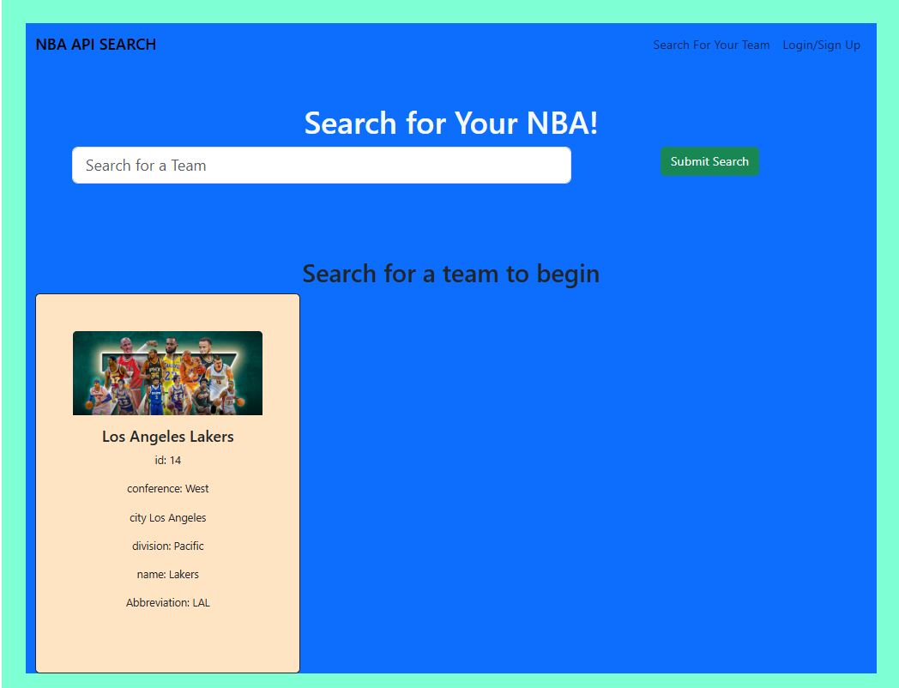
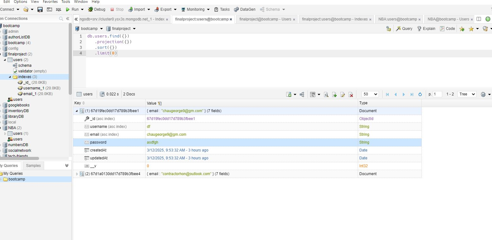
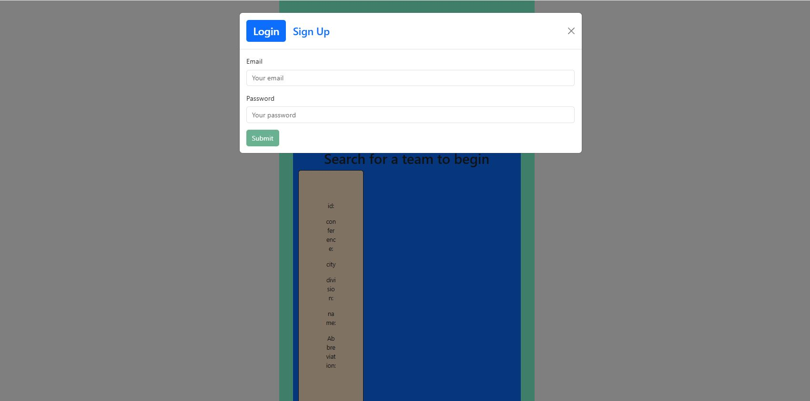
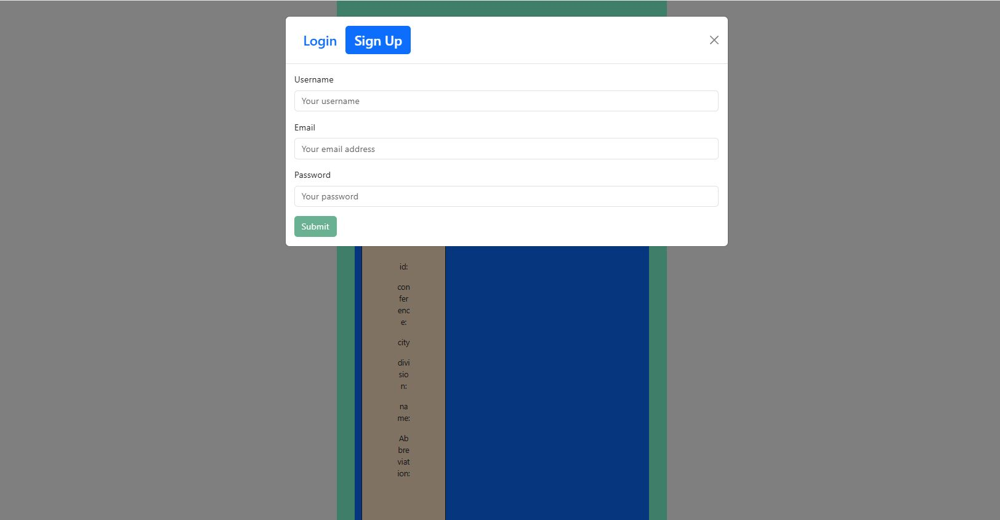

# SportsAPI

## Description
    NBA API Search Engine with JWT token is secure and fast. Data is saved at MongoDB. Login to input, to do list, or modify the status. Thanks for viewing. 
    
    Deployment: https://sportsnba.onrender.com

    Repository: https://github.com/georgecho98/SportsNBAAPI
    
    Presentation: https://docs.google.com/presentation/d/1cSEcA4kD1PnKmNpTXqkPoUu1VkN89Gifan_jVJv7xdA/edit?usp=sharing

    
## Table of Contents
1. [Installation](#installation)
2. [License](#license)
3. [Credit](#credit)
4. [Questions](#questions)

## Installation 
    
    Download the repostary. Then follow the following step: 
    npm install
    npm run render-build
    npm run start

    Place your .env file in the server folder. and input your mongoose URI, JWT token and sport API key in there.

    For the development version: npm run develop

## License
    no license

## Credit
    React, Javascript, API, JWT, express server 

## Usage
   

Search homepage

Save login information in mongoose database

## Questions
    
    If you have any questions, feel free to reach out to me at (mailto:chauhk88@gmail.com).
    
    Github repository:
    https://github.com/georgecho98/SportsNBAAPI

    